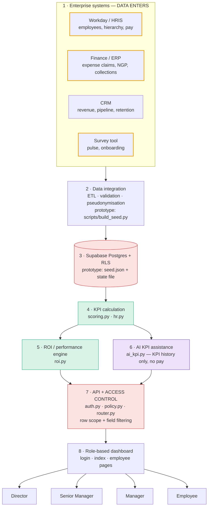

# Glocomp commercial performance & ROI platform — prototype guide

The prototype shows how the commercial team's contribution and return can be made visible:
- explainable performance scores
- financial and non-financial KPIs
- configurable weightage by role
- ROI on the full cost base
- AI-assisted KPI setting
- an HR intervention workflow

Each level of the hierarchy sees only what it should. See `SECURITY.md` for the access model and `/architecture` for the visual data-flow diagram.

## 1. Verified technology stack

Checked against the code on 2026-10-02.

| Layer | Prototype (what actually runs) | Production target |
|---|---|---|
| Hosting | **Vercel**: static pages + one Python serverless function (`api/app.py`) | Vercel |
| Backend | Python standard library: `auth`, `policy`, `scoring`, `roi`, `hr`, `ai_kpi`, `router` in `api/_lib/` | Same code, with a storage adapter for Supabase |
| Data store | `api/_lib/data/seed.json` (read-only) + JSON state file (`/tmp` on Vercel) | **Supabase Postgres** with RLS (`supabase/schema.sql`) |
| Auth | Signed HttpOnly cookie; demo access code + persona | Supabase Auth / SSO with MFA |
| AI | Rules-based mock (`ai_kpi.py`, engine `mock-rules-v1`) | LLM behind the same interface, still requiring human approval |
| Sources | `hr_dummy_dataset.xlsx` (synthetic HR) + anonymised commercial roster | Workday/HRIS, ERP, CRM, PSA, survey tool |

> **Supabase is not used yet.** Before this upgrade, the deployed app was two static HTML files with all data embedded and no backend. Supabase is the next step, and the schema with RLS is ready in `supabase/schema.sql`.



Data enters only at layers 1–2. **Calculations** run server-side (4–5). **AI** is used only at 6. **Access control** happens at 7 (and at 3 via RLS in the target). **Sensitive data** is filtered at 7 before any response is built.

## 2. Running it

```bash
python dev_server.py
```
Open http://localhost:8000. The local access code is `glocomp-demo`. Run the tests with `python -m unittest discover -s tests -v`.

Rebuild the seed with `pip install openpyxl`, then `python scripts/build_seed.py`. The script reads `data/source/hr_dummy_dataset.xlsx`, which is git-ignored, so re-download it from the dataset link if needed.

**Deploy (Vercel):** import the repo with no build settings, then set these environment variables:
- `SESSION_SECRET` (a long random string)
- `DEMO_ACCESS_CODE`

Without them, sign-in is refused (fail closed).

## 3. How the numbers are calculated

**Performance score** (`scoring.py`):

```
KPI attainment = actual ÷ target        (target ÷ actual when lower is better, e.g. DSO)
KPI points     = group weight × KPI weight in group × min(attainment, 100%)
Overall        = Σ financial points + Σ non-financial points
```

Example: Financial 60% × Revenue 50% = 30 points possible. 91.6% attainment earns 27.5 points. If financial KPIs earn 50 of 60 and non-financial earn 32 of 40, the overall score is **82%**.

Clicking any score opens the full calculation: the weightage, each KPI's calculation, the subtotals, where the missing points went, and the 4-quarter trend.

**ROI** (`roi.py`, current quarter):

```
Return       = attributed NGP (Sales: own closed-won NGP; others: department share by attribution matrix)
Total cost   = salary + variable pay (commission earned or bonus accrual)
             + approved expense claims (client entertainment, travel, other sales, training)
             + other employment cost (employer statutory, benefits, tools)
ROI          = (Return − Total cost) ÷ Total cost       Cost coverage = Return ÷ Total cost
```

Cost structures differ per person: commission vs. bonus, department expense profile, and statutory rate by salary band.

## 4. KPI weightage

- Stored in the state store (target: the `role_templates` / `employee_kpi_agreements` tables), not hard-coded. Seed defaults are only the starting point.
- **Role templates** can be changed by the Director (any role) or a Senior Manager (roles in their departments).
- **Individual agreements** can be changed by the employee's Manager (within ±15 points of the template's financial weight), Senior Manager or the Director.
- **Employees** can view their weightage only.
- Every change needs a reason, can be previewed (before/after scores for everyone affected), and is audit-logged. Scores recalculate immediately.

| Role family | Financial / non-financial default | KPIs |
|---|---|---|
| Sales | 60 / 40 | Revenue 50, NGP 30, Collections 20 / Retention 60, Win rate 40 |
| Sales Support | 10 / 90 | Renewal value 100 / Order accuracy 35, Renewal completion 35, Quote turnaround 30 |
| Product Management | 35 / 65 | Attributed NGP 100 / Deal-support win rate 55, SLA compliance 45 |
| Consulting | 20 / 80 | Chargeable revenue 100 / Utilisation 50, Scoping accuracy 50 |
| Delivery | 30 / 70 | Project margin 60, DSO 40 / CSAT 50, On-time delivery 50 |

These are illustrative starting values to agree with each function head. The original prototype weighted Sales at 90/10. The new default follows the 60/40 example in the brief.

## 5. AI-assisted KPI workflow

Historical performance → AI suggestions (`pending_review`) → manager reviews → manager edits the target and/or weight → manager accepts or rejects → **Approve & apply** → the KPI becomes part of the evaluation. It is tagged *"AI-suggested, approved by …"* on the employee's own page.

The engine proposes three kinds of change:
- **Re-target:** the target was beaten in every quarter, or missed team-wide.
- **Re-weight:** move weight onto the KPI causing the largest gap.
- **New KPI:** a leading indicator for the current gap, with a target taken from the person's own history and the peer median.

It never applies anything itself. Only someone who manages the employee can apply suggestions, and the server enforces this. In the prototype, applied changes take effect in the current period. In production they should apply from the next period.

## 6. HR intervention workflow

Performance gap → affected KPI → possible cause/context → suggested action → manager review → escalation.

- **Causes:** the 4-quarter pattern (sustained, declining or recent drop), a peer comparison (team-wide or individual), leading indicators that are also below target, and, at Executive/HR level only, the person's own pulse/onboarding survey signals. Related organisational actions from the action tracker are linked where relevant.
- **Escalation:**
  - The **Manager** records an action plan and review date, then can escalate or resolve.
  - The **Senior Manager** escalates to Executive/HR, returns the case to the manager, or resolves it.
  - The **Director/HR** decides: resolved, continue a structured support plan, redeploy, or end employment.
- The suggested stage comes from how many consecutive quarters the score has been below 75%. All moves are manual and audit-logged.

## 7. What each level sees (demo flow)

Sign in at `/login`. Local access code: `glocomp-demo`.

1. **Employee** — pick *Kiran Bose* from the employee list.
   - My Performance shows Overall 66%, with Financial 38 of 60 and Non-financial 28 of 40.
   - Click **Overall** to walk through the calculation.
   - The KPI table shows each target, actual, gap and weight; the highlighted row is the KPI causing the biggest gap (Revenue booked).
   - The weightage bar is view-only. There is no pay information anywhere.
   - Try `/dashboard`: the page redirects back, and the API returns 403.
2. **Manager** — *Xavier Lam (Sales Manager)*.
   - **Performance** lists the 22-person team (lowest score first), with team survey themes in aggregate.
   - **HR Intervention** shows Kiran's case: gap → Revenue booked → causes (pipeline coverage and win rate are also low) → actions. Record a plan, then escalate. After that, the manager can no longer move the case.
   - **AI KPI Assistant**: generate suggestions for Kiran. Accept *Pipeline coverage* with an edited weight, reject one, then **Approve & apply**, and the score recalculates.
   - **KPI Weightage**: role templates are view-only. Agree an individual split within ±15 points.
   - There are no pay or ROI tabs at this level.
3. **Senior Manager** — *Wren Abbott (Senior Sales Manager)*.
   - Departments: Sales and Sales Support only.
   - **ROI & Cost** shows department and team aggregates. Individual pay is blocked.
   - Escalate Kiran's case to Executive/HR.
   - Edit the *Account Executive* role template, use **Preview score impact**, then save.
4. **Director** — *Morgan Ellery*.
   - **Company** shows revenue, NGP and EBITDA trends, collections, cost coverage, and the margin waterfall.
   - **ROI & Cost** has an individual cost breakdown. Click **Claims →** to see expense line items (this read is audit-logged).
   - **Individuals (pay)** shows salaries and pay flags.
   - **HR Intervention** includes individual survey context. Record the executive decision.
   - **Access & Security** shows the full access matrix and the audit log of everything done above.

## 8. Reliability & contingency plan

| Scenario | Impact | Prototype behaviour | Production plan |
|---|---|---|---|
| App unavailable (deploy bug, function error) | Dashboards don't load | Vercel keeps previous deployments, so **Instant Rollback** in one click. Static pages are served from the CDN even if the function fails, and they show an error instead of partial data. | Same, plus uptime monitoring and alerting, and a status page. |
| Network outage (user side or ISP) | Users can't reach the app | No offline mode by design: HR data is never cached in the browser (`no-store`). | Communicate via the status page. Managers can use the last exported CSV case log for urgent 1:1s. |
| Database unavailable | No reads/writes | Seed is bundled in the function, so read-only views keep working. State writes go to the instance's `/tmp`. | Supabase high availability + **point-in-time recovery**. The API returns 503 rather than stale or partial data. The ETL retries with backoff. |
| Power/electricity outage | Office power has no effect on the hosted service | Vercel and Supabase run in multi-AZ cloud regions, independent of Glocomp premises. | Choose the Singapore region (`sin1` / `ap-southeast-1`) for latency and data residency, with a documented secondary region. |
| Source system down (Workday/CRM) | Data goes stale | n/a (static seed) | Dashboard shows a "data as of" timestamp. The ETL resumes and back-fills. Scores are not recalculated on partial loads. |
| Bad data load | Wrong scores | Seed is versioned in git; revert the commit. | Validation gates in the ETL (row counts, ranges); load into staging, then swap. Restore with PITR. |

**Backups:**
- **Prototype:** the git repository (code + seed) and the pre-upgrade copy in `glocomp_backups/`. Runtime state is *not* durable on Vercel; export the HR case CSV after demos if it matters.
- **Production:** Supabase daily backups + PITR (7–30 days), a weekly encrypted logical dump (`pg_dump`) to separate storage with restricted access, and restore tests every quarter.

**Restore:**
1. Redeploy the last good build (Vercel rollback).
2. Restore the database to a point in time, or from a dump.
3. Re-run the ETL for the gap period.
4. Verify with the test suite and row-count checks.

**Targets (proposed):** RPO ≤ 24 h (≤ 5 min with PITR), RTO ≤ 4 h. HR records are retained per Glocomp's HR retention policy and PDPA.

## 9. Data notes

- **Commercial roster:** 64 people across Sales, Sales Support, Product Management, Consulting and Delivery. Pay structure and amounts come from the supplied roster; names are fictional.
- Each person is linked to an **active synthetic HR record** in `hr_dummy_dataset.xlsx`, matched on division and employee group. They inherit its tenure, location and pulse/onboarding history. The department-to-division mapping is Sales→Sales, Sales Support→Operations, Product Management→Marketing, Consulting→Technology, Delivery→Operations.
- **KPI actuals, history, expense claims, statutory costs and attributed NGP are dummy data.** They are deterministic, so every rebuild gives the same numbers.
- **Data-quality issue in the supplied dataset:** about 87% of pulse `workload` scores are exactly 1.0 (max 3.0), even though about 25% of comments raise workload. The numeric column looks clipped, so a workload comment is also treated as a workload signal. Please check the generator.

## 10. Known limitations / next steps

1. Move state to Supabase so changes and cases persist.
2. Replace demo sign-in with SSO.
3. Connect real KPI sources.
4. Swap the mock AI for an LLM, keeping the human-approval gate and the no-pay-data rule.
5. Apply agreed changes from the next period, with versioned history.
6. Move inline scripts to files and tighten the CSP.
7. Notifications for escalations.
